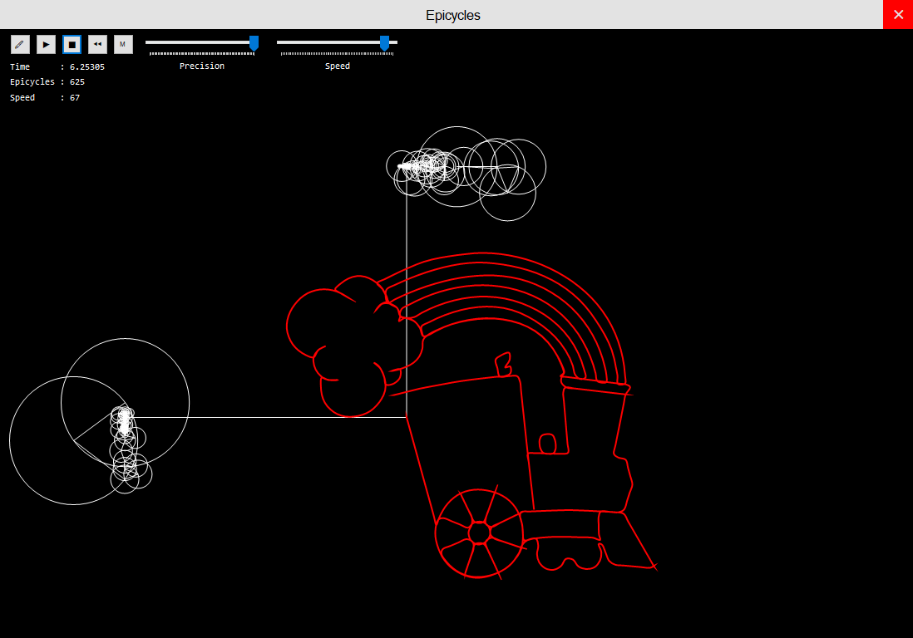

# epicyclez
Numerical Algorithms course project - Drawing image contours using epicycles and DFT

## What are these "epicycles"?

The simplest epicycle is made by having a circle which centre is moving around another circle. You can create more complex epicycles by stacking more and more circles around already existing ones. Epicycles were known even to the ancient Greeks and then later Ptolemy, who used them to explain the complex motions of heavenly objects in his [Ptolemaic planetary motion system](https://www.britannica.com/science/Ptolemaic-system) (this system is so complex that motions of several objects are explained using epicycles consisting of as many as 80 circles!). By stacking circles with appropriate radii and rotating them with appropriate speeds it is possible for the center of the last circle in the stack to trace any given curve, even the famous [Homer Simpson's orbit](https://www.youtube.com/watch?v=QVuU2YCwHjw)!

This program allows you to draw arbitrary shapes and curves and then draws them using specified amount of circles. How does it determine the radii and speeds of all those circles in order to trace the given curve? Well, if we think of a circle being a complex number with it's radius (magnitude of the complex number), initial rotation (phase of the complex number) and fixed rotation speed (frequency), we can calculate magnitude and phase for series of complex numbers with different fixed speeds. This is where DFT comes into picture, as DFT transforms the input function (signal) from time space to frequency space - giving us the values we need through complex numbers of different frequencies (math geeks who want more elaborate explanation can read more [here](https://brettcvz.github.io/epicycles/)). Once we have those complex numbers, all the work needed to be done is to picture them in the complex plane!

And there you have it, not complex at all (no pun intended).